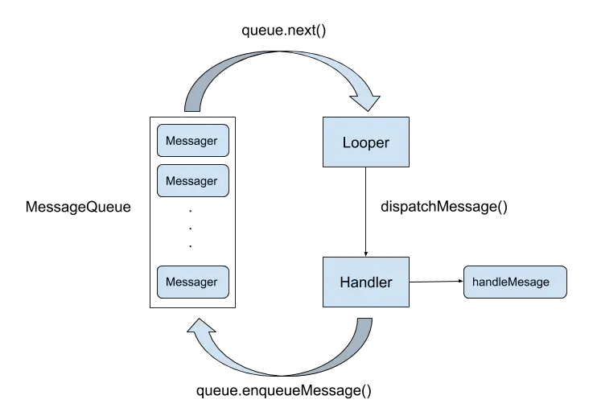
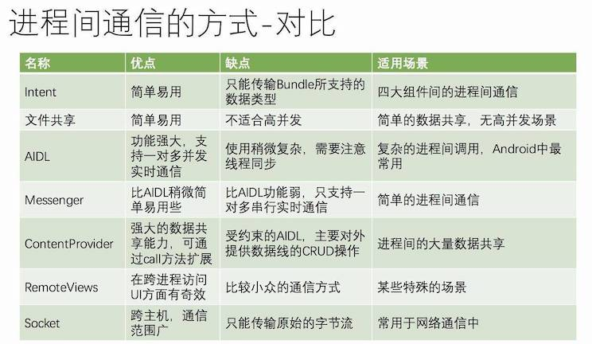

# [基础篇](https://juejin.im/post/5c8211fee51d453a136e36b0)

## Activity

1. 生命周期
2. 四种启动模式
3. [Activity 跟 Window、View 之间的关系](https://blog.csdn.net/zane402075316/article/details/69822438)
   1. 基本
      1. Activity在创建时会调用 attach() 方法初始化一个PhoneWindow(继承于Window)，每一个Activity都包含了唯一一个PhoneWindow
      2. Activity通过setContentView实际上是调用的 getWindow().setContentView将View设置到PhoneWindow上，而PhoneWindow内部是通过 WindowManager 的addView、removeView、updateViewLayout这三个方法来管理View，WindowManager本质是接口，最终由WindowManagerImpl实现
   2. 延伸
      1. WindowManager为每个Window创建Surface对象，然后应用就可以通过这个Surface来绘制任何它想要绘制的东西。而对于WindowManager来说，这只不过是一块矩形区域而已
         1. Surface其实就是一个持有像素点矩阵的对象，这个像素点矩阵是组成显示在屏幕的图像的一部分。我们看到显示的每个Window（包括对话框、全屏的Activity、状态栏等）都有他自己绘制的Surface。而最终的显示可能存在Window之间遮挡的问题，此时就是通过SurfaceFlinger对象渲染最终的显示，使他们以正确的Z-order显示出来。一般Surface拥有一个或多个缓存（一般2个），通过双缓存来刷新，这样就可以一边绘制一边加新缓存。
      2. View是Window里面用于交互的UI元素。Window只attach一个View Tree（组合模式），当Window需要重绘（如，当View调用invalidate）时，最终转为Window的Surface，Surface被锁住（locked）并返回Canvas对象，此时View拿到Canvas对象来绘制自己。当所有View绘制完成后，Surface解锁（unlock），并且post到绘制缓存用于绘制，通过Surface Flinger来组织各个Window，显示最终的整个屏幕
4. 横竖屏切换的Activity生命周期变化
   1. 不设置 Activity的android:configChanges 时，切屏会销毁当前Activity，然后重新加载调用各个生命周期，切横屏时会执行一次，切竖屏时会执行两次；onPause() → onStop() → onDestory() → onCreate() → onStart() → onResume()
   2. 设置 Activity 的 android:configChanges="orientation" (待验证：在 Android5.1 即 API 23级别下，切屏还是会重新调用各个生命周期，切横、竖屏时只会执行一次在Android9 即API 28级别下，切屏不会重新调用各个生命周期，只会执行onConfigurationChanged方法)；[官网说明](https://developer.android.com/guide/topics/manifest/activity-element)：如果您的应用面向Android 3.2即API 级别 13或更高级别（按照 minSdkVersion 和 targetSdkVersion 属性所声明的级别），则还应声明 "screenSize" 配置，因为当设备在横向与纵向之间切换时，该配置也会发生变化。即便是在 Android 3.2 或更高版本的设备上运行，此配置变更也不会重新启动 Activity

## View

1. View 的工作流程
   1. View 的工作流程主要是指 measure 、 layout 、 draw 这三大流程，即测量、布局和绘制，其中 measure 确定 View 的测量宽/高， layout 确定 View 的最终宽/高和四个顶点的位置，而 draw 则将 View 绘制到屏幕上
   2. View的绘制过程遵循如下几步：
      1. 绘制背景 background.draw（canvas）
      2. 绘制自己（onDraw）
      3. 绘制 children（dispatchDraw）
      4. 绘制装饰（onDrawScollBars）
   3. 参考文章
      1. [Android应用层View绘制流程与源码分析](https://blog.csdn.net/yanbober/article/details/46128379)
      2. [Android View的绘制流程](https://www.jianshu.com/p/5a71014e7b1b)
2. MotionEvent 是什么？包含几种事件？什么条件下会产生？
   1. MotionEvent是手指接触屏幕后所产生的一系列事件。典型的事件类型有如下：
      1. ACTION_DOWN ：手指刚接触屏幕
      2. ACTION_MOVE ：手指在屏幕上移动
      3. ACTION_UP ：手指从屏幕上松开的一瞬间
      4. ACTION_CANCELL ：手指保持按下操作，并从当前控件转移到外层控件时触发
3. View 事件传递分发机制
   1. View 事件分发本质就是对 MotionEvent 事件分发的过程。即当一个 MotionEvent 发生后，系统将这个点击事件传递到一个具体的 View 上
   2. 点击事件的传递顺序：Activity （Window） → ViewGroup → View
   3. 事件分发过程由三个方法共同完成：
      1. dispatchTouchEvent ：用来进行事件的分发。如果事件能够传递给当前 View ，那么此方法一定会被调用，返回结果受当前 View 的 onTouchEvent 和下级 View 的 dispatchTouchEvent 方法的影响，表示是否消耗当前事件
      2. onInterceptTouchEvent ：在上述方法内部调用，对事件进行拦截。该方法只在 ViewGroup 中有， View （不包含 ViewGroup ）是没有的。一旦拦截，则执行 ViewGroup 的 onTouchEvent ，在 ViewGroup 中处理事件，而不接着分发给 View 。且只调用一次，返回结果表示是否拦截当前事件
      3. onTouchEvent ： 在 dispatchTouchEvent 方法中调用，用来处理点击事件，返回结果表示是否消耗当前事件
4. 如何解决View的事件冲突 ？ 举个开发中遇到的例子 ？
   1. 常见开发中事件冲突的有ScrollView与RecyclerView的滑动冲突、RecyclerView内嵌同时滑动同一方向
   2. 滑动冲突的处理规则：
      1. 对于由于外部滑动和内部滑动方向不一致导致的滑动冲突，可以根据滑动的方向判断谁来拦截事件。
      2. 对于由于外部滑动方向和内部滑动方向一致导致的滑动冲突，可以根据业务需求，规定何时让外部View拦截事件，何时由内部View拦截事件。
      3. 对于上面两种情况的嵌套，相对复杂，可同样根据需求在业务上找到突破点。
   3. 滑动冲突的实现方法：
      1. 外部拦截法：指点击事件都先经过父容器的拦截处理，如果父容器需要此事件就拦截，否则就不拦截。具体方法：需要重写父容器的onInterceptTouchEvent方法，在内部做出相应的拦截。
      2. 内部拦截法：指父容器不拦截任何事件，而将所有的事件都传递给子容器，如果子容器需要此事件就直接消耗，否则就交由父容器进行处理。具体方法：需要配合requestDisallowInterceptTouchEvent方法。
5. invalidate() 和 postInvalidate() 的区别
   1. invalidate()与postInvalidate()都用于刷新View，主要区别是invalidate()在主线程中调用，若在子线程中使用需要配合handler；而postInvalidate()可在子线程中直接调用。
6. SurfaceView 和 View 的区别
   1. View 需要在 UI 线程对画面进行刷新，而 SurfaceView 可在子线程进行页面的刷新
   2. View 适用于主动更新的情况，而 SurfaceView 适用于被动更新，如频繁刷新，这是因为如果使用 View 频繁刷新会阻塞主线程，导致界面卡顿
   3. SurfaceView 在底层已实现双缓冲机制，而 View 没有，因此 SurfaceView 更适用于需要频繁刷新、刷新时数据处理量很大的页面（如视频播放界面）

## Service

## Broadcast Receiver

## [ContentProvider]([Android：关于ContentProvider的知识都在这里了！](https://blog.csdn.net/carson_ho/article/details/76101093))

1. ContentProvider 了解多少?
   1. ContentProvider作为四大组件之一，其主要负责存储和共享数据。与文件存储、SharedPreferences 存储、SQLite数据库存储这几种数据存储方法不同的是，后者保存下的数据只能被该应用程序使用，而前者可以让不同应用程序之间进行数据共享，它还可以选择只对哪一部分数据进行共享，从而保证程序中的隐私数据不会有泄漏风险。
2. ContentProvider 的权限管理？
   1. 读写分离
   2. 权限控制-精确到表级
   3. URL控制
3. ContentProvider 、 ContentResolver 、 ContentObserver
   1. ContentProvider ：管理数据，提供数据的增删改查操作，数据源可以是数据库、文件、 XML 、网络等， ContentProvider 为这些数据的访问提供了统一的接口，可以用来做进程间数据共享。
   2. ContentResolver ： ContentResolver 可以为不同 URI 操作不同的 ContentProvider 中的数据，外部进程可以通过 ContentResolver 与 ContentProvider 进行交互。
   3. ContentObserver ：观察 ContentProvider 中的数据变化，并将变化通知给外界。

## 数据存储

1. Android 数据持久存储方式
   1. SharedPreferences 存储：一种轻型的数据存储方式，本质是基于 XML 文件存储的 key-value 键值对数据，通常用来存储一些简单的配置信息（如应用程序的各种配置信息）；
   2. SQLite 数据库存储：一种轻量级嵌入式数据库引擎，它的运算速度非常快，占用资源很少，常用来存储大量复杂的关系数据；
   3. ContentProvider ：四大组件之一，用于数据的存储和共享，不仅可以让不同应用程序之间进行数据共享，还可以选择只对哪一部分数据进行共享，可保证程序中的隐私数据不会有泄漏风险；
   4. File 文件存储：写入和读取文件的方法和 Java中实现I/O的程序一样；
   5. 网络存储：主要在远程的服务器中存储相关数据，用户操作的相关数据可以同步到服务器上；
2. [SharedPreferences 的应用场景及注意事项](https://blog.csdn.net/geekerhw/article/details/79713068)
   1. SharedPreferences 是一种轻型的数据存储方式，本质是基于XML文件存储的 key-value 键值对数据，通常用来存储一些简单的配置信息，如 int 、 String 、 boolean 、 float 和 long ；
   2. 注意事项：
      1. 勿存储大型复杂数据，这会引起内存 GC 、阻塞主线程使页面卡顿产生 ANR
      2. 勿在多进程模式下，操作 Sp
      3. 不要多次 edit 和 apply ，尽量批量修改一次提交
      4. 建议 apply ，少用 commit
   3. SharedPrefrences 的 apply 和 commit 有什么区别
   4. 了解 SQLite 中的事务操作吗？是如何做的
      1. SQLite 在做 CRDU 操作时都默认开启了事务，然后把 SQL 语句翻译成对应的 SQLiteStatement 并调用其相应的 CRUD 方法，此时整个操作还是在 rollback journal 这个临时文件上进行，只有操作顺利完成才会更新 db 数据库，否则会被回滚；
   5. 使用 SQLite 做批量操作有什么好的方法吗
      1. 使用 SQLiteDatabase 的 beginTransaction 方法开启一个事务，将批量操作 SQL 语句转化为 SQLiteStatement 并进行批量操作，结束后 endTransaction()
   6. 如何删除 SQLite 中表的个别字段
      1. SQLite数据库只允许增加字段而不允许修改和删除表字段，只能创建新表保留原有字段，删除原表
   7. 使用SQLite时会有哪些优化操作
      1. 使用事务做批量操作
      2. 及时关闭 Cursor ，避免内存泄露
      3. 耗时操作异步化：数据库的操作属于本地IO耗时操作，建议放入异步线程中处理
      4. ContentValues 的容量调整： ContentValues 内部采用 HashMap 来存储 Key-Value 数据， ContentValues 初始容量为8，扩容时翻倍。因此建议对 ContentValues 填入的内容进行估量，设置合理的初始化容量，减少不必要的内部扩容操作
      5. 使用索引加快检索速度：对于查询操作量级较大、业务对查询要求较高的推荐使用索引

## 线程

1. 线程池的好处？ 四种线程池的使用场景，线程池的几个参数的理解？
   1. 使用线程池的好处是减少在创建和销毁线程上所花的时间以及系统资源的开销，解决资源不足的问题。如果不使用线程池，有可能造成系统创建大量同类线程而导致消耗完内存或则“过度切换”的问题，归纳总结就是
      1. 重用存在的线程，减少对象创建、消亡的开销，性能佳。可有效控制最大并发线程数，提高系统资源的使用率，同时避免过多资源竞争，避免堵塞。
      2. 提供定时执行、定期执行、单线程、并发数控制等功能。
   2. Android 中的线程池都是直接或间接通过配置 ThreadPoolExecutor 来实现不同特性的线程池。 Android 中最常见的类具有不同特性的线程池分别为：
      1. newCachedThreadPool ：只有非核心线程，最大线程数非常大，所有线程都活动时会为新任务创建新线程,否则会利用空闲线程 ( 60s空闲时间,过了就会被回收,所以线程池中有0个线程的可能 )来处理任务.
         1. 优点：任何任务都会被立即执行(任务队列 SynchronousQuue 相当于一个空集合)；比较适合执行大量的耗时较少的任务。
      2. newFixedThreadPool ：只有核心线程，并且数量固定的，所有线程都活动时，因为队列没有限制大小，新任务会等待执行，当线程池空闲时不会释放工作线程，还会占用一定的系统资源。
         1. 优点：更快的响应外界请求
      3. newScheduledThreadPool ：核心线程数固定,非核心线程（闲着没活干会被立即回收数）没有限制.
         1. 优点：执行定时任务以及有固定周期的重复任务
      4. newSingleThreadExecutor ：只有一个核心线程,确保所有的任务都在同一线程中按序完成
         1. 优点：不需要处理线程同步的问题
      5. 通过源码可以了解到上面的四种线程池实际上还是利用 ThreadPoolExecutor 类实现的
2. Android中还了解哪些方便线程切换的类
   1. AsyncTask ：底层封装了线程池和Handler，便于执行后台任务以及在子线程中进行UI操作。
   2. HandlerThread ：一种具有消息循环的线程，其内部可使用 Handler。
   3. IntentService ：是一种异步、会自动停止的服务，内部采用 HandlerThread。
3. AsyncTask 的原理
   1. AsyncTask 中有两个线程池（ SerialExecutor 和 THREAD_POOL_EXECUTOR ）和一个 Handler （ InternalHandler ），其中线程池 SerialExecutor 用于任务的排队，而线程池 THREAD_POOL_EXECUTOR 用于真正地执行任务， InternalHandler 用于将执行环境从线程池切换到主线程。
   2. sHandler 是一个静态的 Handler 对象，为了能够将执行环境切换到主线程，这就要求 sHandler 这个对象必须在主线程创建。由于静态成员会在加载类的时候进行初始化，因此这就变相要求 AsyncTask 的类必须在主线程中加载，否则同一个进程中的 AsyncTask 都将无法正常工作。
4. IntentService 有什么用
   1. IntentService 可用于执行后台耗时的任务，当任务执行完成后会自动停止，同时由于 IntentService 是服务的原因，不同于普通 Service ， IntentService 可自动创建子线程来执行任务，这导致它的优先级比单纯的线程要高，不容易被系统杀死，所以 IntentService 比较适合执行一些高优先级的后台任务。
5. 直接在 Activity 中创建一个 thread 跟在 service 中创建一个 thread 之间的区别
   1. 在 Activity 中被创建：该 Thread 的就是为这个 Activity 服务的，完成这个特定的 Activity 交代的任务，主动通知该 Activity 一些消息和事件， Activity 销毁后，该 Thread 也没有存活的意义了。
   2. 在 Service 中被创建：这是保证最长生命周期的 Thread 的唯一方式，只要整个 Service 不退出， Thread 就可以一直在后台执行，一般在 Service 的 onCreate() 中创建，在 onDestroy() 中销毁。所以，在 Service 中创建的 Thread ，适合长期执行一些独立于 APP 的后台任务，比较常见的就是：在 Service 中保持与服务器端的长连接。

## Handler

1. 谈谈消息机制 Handler 作用 ？有哪些要素 ？流程是怎样的 ？
   1. 负责跨线程通信，这是因为在主线程不能做耗时操作，而子线程不能更新 UI ，所以当子线程中进行耗时操作后需要更新 UI 时，通过 Handler 将有关 UI 的操作切换到主线程中执行。
   2. 具体分为四大要素
      1. Message（消息）：需要被传递的消息，消息分为硬件产生的消息（如按钮、触摸）和软件生成的消息。
      2. MessageQueue（消息队列）：负责消息的存储与管理，负责管理由 Handler 发送过来的 Message。读取会自动删除消息，单链表维护，插入和删除上有优势。在其 next() 方法中会无限循环，不断判断是否有消息，有就返回这条消息并移除。
      3. Handler（消息处理器）：负责 Message 的发送及处理。主要向消息池发送各种消息事件（Handler.sendMessage()）和处理相应消息事件（Handler.handleMessage()），按照先进先出执行，内部使用的是单链表的结构。
      4. Looper（消息池）：负责关联线程以及消息的分发，在该线程下从 MessageQueue 获取 Message ，分发给 Handler ， Looper 创建的时候会创建一个 MessageQueue ，调用 loop() 方法的时候消息循环开始，其中会不断调用 messageQueue 的 next() 方法，当有消息就处理，否则阻塞在 messageQueue 的 next() 方法中。当 Looper 的 quit() 被调用的时候会调用 messageQueue 的 quit() ，此时 next() 会返回 null，然后 loop() 方法也就跟着退出。
   3. 具体流程如下
      >
      1. 在主线程创建的时候会创建一个Looper，同时也会在在Looper内部创建一个消息队列。而在创键Handler的时候取出当前线程的Looper，并通过该Looper对象获得消息队列，然后Handler在子线程中通过MessageQueue.enqueueMessage在消息队列中添加一条Message。
      2. 通过Looper.loop() 开启消息循环不断轮询调用 MessageQueue.next()，取得对应的Message并且通过Handler.dispatchMessage传递给Handler，最终调用Handler.handlerMessage处理消息。
2. 一个线程能否创建多个 Handler ， Handler 跟 Looper 之间的对应关系
   1. 一个 Thread 只能有一个 Looper ，一个 MessageQueen ，可以有多个 Handler
   2. 以一个线程为基准，他们的数量级关系是： Thread(1) : Looper(1) : MessageQueue(1) : Handler(N)
3. Handler 引起的内存泄露原因以及最佳解决方案
   1. 泄露原因：
      1. Handler 允许我们发送延时消息，如果在延时期间用户关闭了 Activity，那么该 Activity 会泄露。 这个泄露是因为 Message 会持有 Handler，而又因为 Java 的特性，内部类会持有外部类，使得 Activity 会被 Handler 持有，这样最终就导致 Activity 泄露。
   2. 解决方案：
      1. 将 Handler 定义成静态的内部类，在内部持有Activity的弱引用，并在Acitivity的onDestroy()中调用 handler.removeCallbacksAndMessages(null) 及时移除所有消息。
4. 为什么系统不建议在子线程访问UI？
   1. Android 的 UI 控件不是线程安全的，如果在多线程中并发访问可能会导致 UI 控件处于不可预期的状态
   2. 这时你可能会问为何系统不对UI控件的访问加上锁机制呢？因为
      1. 加锁机制会让 UI 访问逻辑变的复杂
      2. 加锁机制会降低 UI 的访问效率,因为加锁会阻塞某些线程的执行
5. Looper 死循环为什么不会导致应用卡死？
   1. 主线程的主要方法就是**消息循环**，一旦退出消息循环，那么你的应用也就退出了， Looer.loop() 方法可能会引起主线程的阻塞，但只要它的消息循环没有被阻塞，能一直处理事件就不会产生 ANR 异常。
   2. 造成 **ANR** 的不是主线程阻塞，而是主线程的 Looper 消息处理过程发生了**任务阻塞**，无法响应手势操作，不能及时刷新 UI 。
   3. **阻塞与程序无响应**没有必然关系，虽然主线程在没有消息可处理的时候是阻塞的，但是只要保证有消息的时候能够立刻处理，程序是不会无响应的。
6. 使用Handler的postDealy后消息队列会有什么变化
   1. 如果队列中只有这个消息，那么消息不会被发送，而是计算到时唤醒的时间，先将 Looper 阻塞，到时间就唤醒它。但如果此时要加入新消息，该消息队列的对头跟 delay 时间相比更长，则插入到头部，按照触发时间进行排序，队头的时间最小、队尾的时间最大
7. 可以在子线程直接new一个Handler吗？怎么做？
   1. 不可以，因为在主线程中， Activity 内部包含一个 Looper 对象，它会自动管理 Looper ，处理子线程中发送过来的消息。而对于子线程而言，没有任何对象帮助我们维护 Looper 对象，所以需要我们自己手动维护。所以要在子线程开启 Handler 要先创建 Looper ，并开启 Looper 循环
   2. 代码示例

   ``` java
   new Thread(new Runnable(){
      @Override
      public void run (){
         Looper.prepare();
         new Handler(){
            @Override
            public void handleMessage(Message msg){
               super.handleMessage(msg);
            }
         };
         Looper.loop();
      }
   })
   ```

8. Message可以如何创建？哪种效果更好，为什么？
   1. 可以通过三种方法创建：
      1. 直接生成实例Message m = new Message
      2. 通过Message m = Message.obtain
      3. 通过Message m = mHandler.obtainMessage()
   2. 后两者效果更好，因为 Android 默认的消息池中消息数量是10，而后两者是直接在消息池中取出一个 Message 实例，这样做就可以避免多生成 Message 实例。

## IPC 进程间通信

1. [Android中进程和线程的关系和区别](https://developer.android.com/guide/components/processes-and-threads?hl=zh-cn)
   1. 线程是CPU调度的最小单元，同时线程是一种有限的系统资源
   2. 进程一般指一个执行单元，在PC和移动设备上一个程序或则一个应用
   3. 一般来说，一个App程序至少有一个进程，一个进程至少有一个线程（包含与被包含的关系），通俗来讲就是，在App这个工厂里面有一个进程，线程就是里面的生产线，但主线程（主生产线）只有一条，而子线程（副生产线）可以有多个
   4. 进程有自己独立的地址空间，而进程中的线程共享此地址空间，都可以并发执行
2. 如何开启多进程 ？ 应用是否可以开启N个进程 ？
   1. 在 AndroidMenifest 中给四大组件指定属性 android:process 开启多进程模式
   2. 在内存允许的条件下可以开启N个进程
3. 为何需要IPC？多进程通信可能会出现的问题？
   1. 所有运行在不同进程的四大组件（Activity、Service、Receiver、ContentProvider）共享数据都会失败，这是由于 Android 为每个应用（确切说是为每个进程）分配了独立的虚拟机，不同的虚拟机在内存分配上有不同的地址空间，这会导致在不同的虚拟机中访问同一个类的对象会产生多份副本。比如常用例子（通过开启多进程获取更大内存空间、两个或则多个应用之间共享数据、微信全家桶）
   2. 一般来说，使用多进程通信会造成如下几方面的问题
      1. 静态成员和单例模式完全失效：独立的虚拟机造成
      2. 线程同步机制完全实效：独立的虚拟机造成
      3. SharedPreferences 的可靠性下降：这是因为 Sp 不支持两个进程并发进行读写，有一定几率导致数据丢失
      4. Application 会多次创建： Android  系统在创建新的进程会分配独立的虚拟机，所以这个过程其实就是启动一个应用的过程，自然也会创建新的 Application
4. Android 中 IPC 方式、各种方式优缺点，为什么选择 Binder ？
   >
